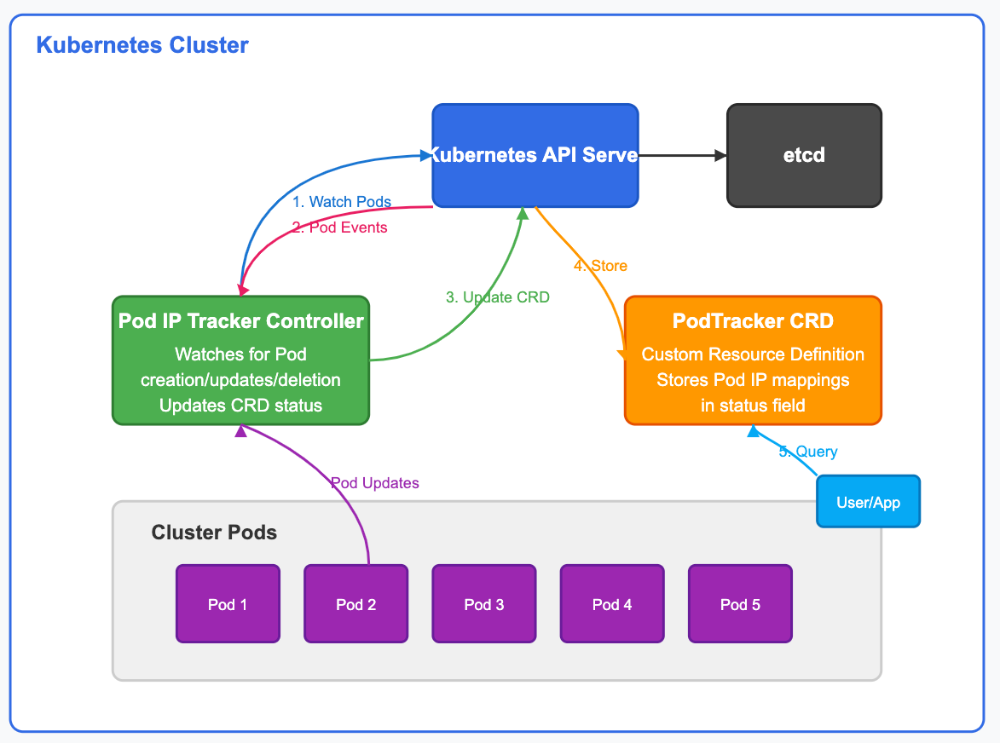
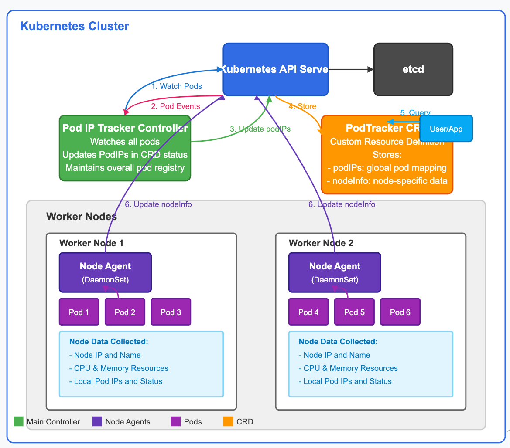

# System Components

Kubernetes API Server: The core component of the Kubernetes control plane that exposes the Kubernetes API. All communications in the system flow through the API server.
etcd: The persistent storage where all Kubernetes cluster data is saved, including our PodTracker Custom Resource.
Pod IP Tracker Controller: This is the custom controller we've built that watches for Pod events (creation, updates, deletion) and keeps track of their IP addresses.
PodTracker CRD (Custom Resource Definition): The schema that extends the Kubernetes API, defining a new resource type to store pod IP information.
Cluster Pods: The actual Pods running across your Kubernetes cluster whose IP addresses are being tracked.

Key Workflows
The architecture works through these primary workflows:
1. Pod Event Monitoring

The controller establishes a watch connection to the Kubernetes API Server for Pod resources
When Pods are created/updated/deleted, the API Server sends events to our controller
The controller processes these events and determines if any PodTracker resources need to be updated

2. CRD Status Updates

The controller retrieves the current list of Pods and their IP addresses
It then updates the status section of the PodTracker Custom Resource
The updated information is persisted in etcd via the API Server

3. Information Retrieval

Users and applications can query the PodTracker resource via standard kubectl commands or the Kubernetes API
This provides a consistent, centralized view of all Pod IPs in the cluster or a specific namespace

Technical Implementation
Our implementation has:

A Go-based controller built with controller-runtime that:

Watches for Pod events across the cluster
Maintains finalizers for proper cleanup
Processes Pod information and extracts IP addresses
Updates the PodTracker status with current information

A cluster-scoped CRD that:

Defines the PodTracker resource type
Includes spec fields for configuration (like namespace filtering)
Maintains status fields for Pod IP information
Provides additional metadata like creation timestamps and node placement

Deployment resources that:

Set up proper RBAC permissions
Deploy the controller securely in the cluster
Establish watch connections to the API server

This architecture follows the Kubernetes operator pattern, extending the Kubernetes API with custom resources and controllers to provide specialized functionality in a Kubernetes-native way.

Here's an updated architecture diagram showing how the new DaemonSet agents collect node information and interact with the CRD:

# Enhanced Pod IP Tracker Architecture with DaemonSet Node Agents

The updated architecture introduces node-level agents that run as a DaemonSet to enhance the system with detailed node information. Here's how the enhanced architecture works:

## System Components

### 1. Main Controller (Central)
- Runs as a singleton deployment in the cluster
- Watches for pod events across all namespaces
- Maintains the global list of pod IPs in the CRD's `podIPs` field
- Preserves the node-specific information when updating the CRD

### 2. Node Agents (DaemonSet)
- Run exactly one pod on each worker node in the cluster
- Collect node-specific information:
    - Node IP address and name
    - CPU and memory resources (capacity and allocatable)
    - Detailed information about pods running on that specific node
- Update the `nodeInfo` section of the PodTracker CRD

### 3. PodTracker CRD (Data Store)
- Now has an enhanced schema with two main sections:
    - `podIPs`: Global registry of all pods and their IPs (updated by main controller)
    - `nodeInfo`: Array of node-specific information (updated by node agents)
- Serves as a centralized registry queryable through the Kubernetes API

## Data Flow

1. **Main Controller Watch Loop**:
    - Continuously monitors all pods in the cluster
    - When pods change, updates the `podIPs` field while preserving the `nodeInfo` data

2. **Node Agent Collection Cycle**:
    - Each agent runs on one node and only collects data for that node
    - Queries the local node for system resources and configuration
    - Lists pods running on that specific node
    - Updates the `nodeInfo` array in the PodTracker CRD

3. **API Server Storage**:
    - Both the main controller and node agents communicate with the API server
    - The API server persists changes to etcd
    - Ensures data consistency through optimistic concurrency control

4. **User/Application Queries**:
    - Applications can query the API server for the PodTracker resource
    - Can retrieve both global pod IP information and node-specific details
    - Filter by node, namespace, or individual pod names

## Benefits of this Architecture

1. **Enhanced Data Collection**: Provides both cluster-wide and node-specific views of pod IP information

2. **Resource Efficiency**:
    - Main controller handles lightweight global monitoring
    - Node agents focus only on their specific node, improving scalability
    - Distributes the workload across the cluster

3. **Improved Insights**:
    - Node resource information (CPU, memory)
    - Node-to-pod mapping for network topology understanding
    - Real-time node status and health metrics

4. **Fault Tolerance**:
    - If a node agent fails, only data for that specific node is affected
    - The main controller continues to maintain the global pod IP registry
    - Each component operates independently but cooperatively

This architecture effectively combines a centralized controller for global monitoring with distributed node agents for detailed local information, providing a comprehensive view of pod IPs across the Kubernetes cluster.